## 一、项目结构
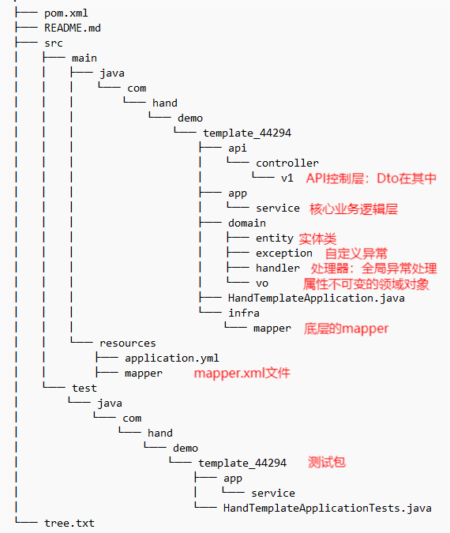
#### 疑问
* vo: 不可变的属性、只有getter方法、表示领域对象的属性
* dto: 用于传输数据对象，通常用于在不同层之间传递数据

----
## 二、学习记录
### 依赖注入
#### 方式
* setter
* 构造方法
#### 场景
* 普通Bean注入
  * @Component + @Autowired
  * @Scope 设置Bean的作用域
* 设置别名
  * @Bean(name)
  * @Qualifier(name)
  
  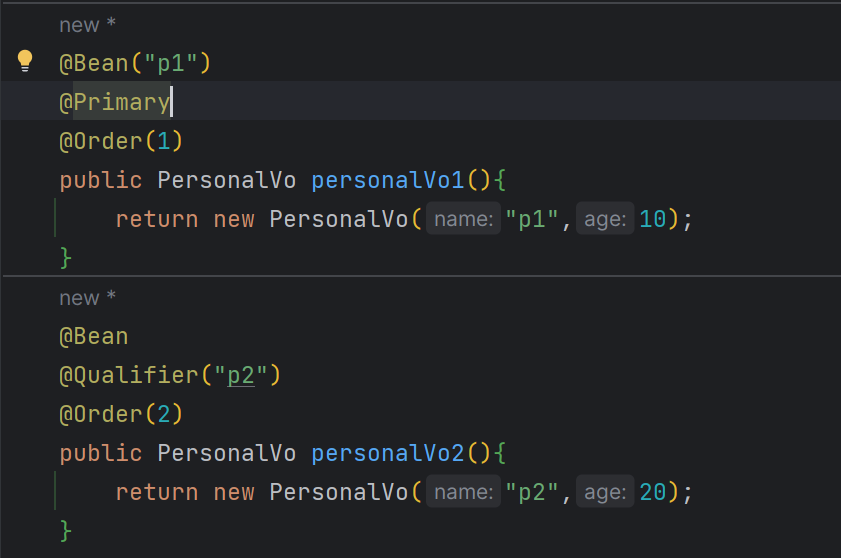
* 忽略不存在的Bean
  * @Autowired(required=false)
* Bean注入List
  * @Component + @Order + @Autowired

  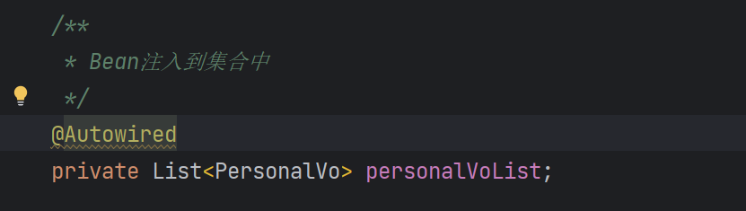

#### Bean没有@Component注解（三方库）
```Java
@Configuration
@ComponentScan
public class AppConfig {
    // 创建一个Bean:
    @Bean
    ZoneId createZoneId() {
        return ZoneId.of("Z");
    }
}
```
### Bean创建
#### 初始化和销毁
* @PostConstruct
* @PreDestroy
* Spring只根据注解寻找没有参数的方法，与方法名无关
#### 通过工厂模式创建Bean（TODO:工厂模式）
* 实现Factory<T>接口
* 重写getObject方法

----

## 三、项目练习

### 全局异常处理
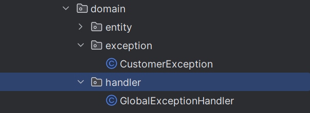
#### 自定义的异常类
  * 部分场景，手动抛出异常结束程序，反馈信息更灵活
#### 配置全局异常处理器
  * 让自定义异常类生效
  * 对未知异常进行标记和处理

----

### 前后端交互协议
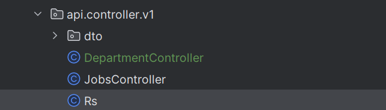
#### 响应格式
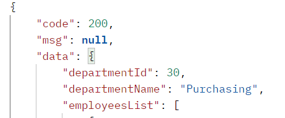
#### 疑惑
* Rs类应该放在哪个包里

----

### API控制层
* 暴露 API

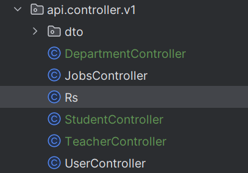

----

### 接口测试
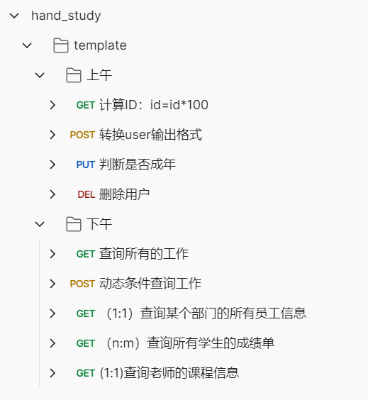

* 接口测试文件(Postman Json)

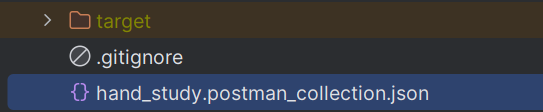

### Mybatis增删改查
#### 建表SQL文件
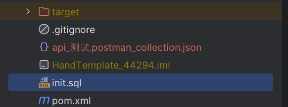
#### 增删改查
* 批量插入

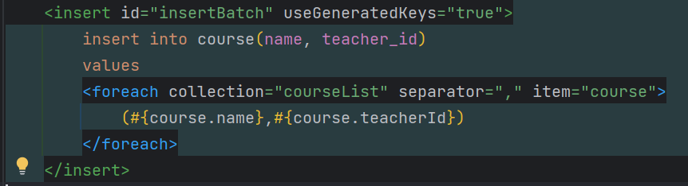
* 修改

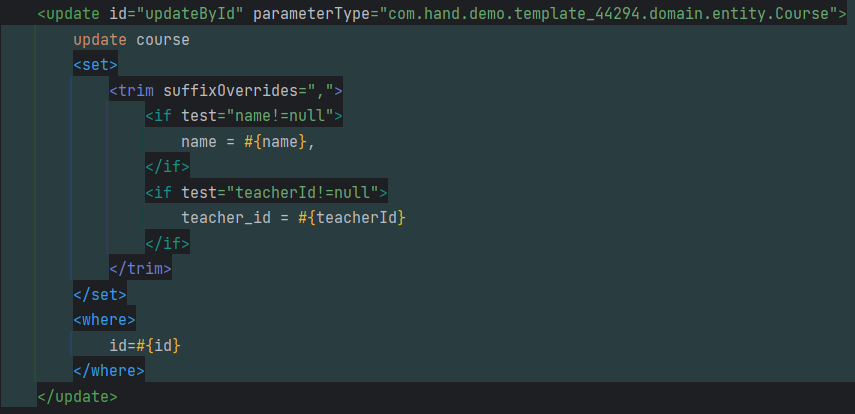
* 删除

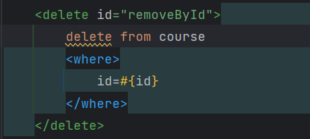
* 查询

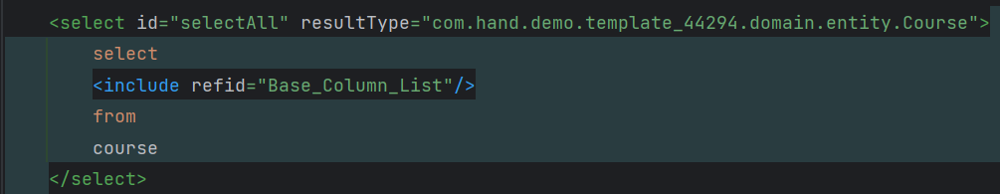

#### 增删改查的Junit 测试
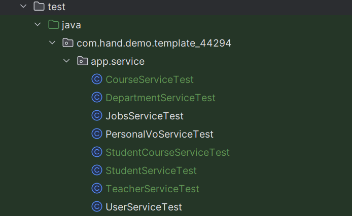

#### 多条件查询
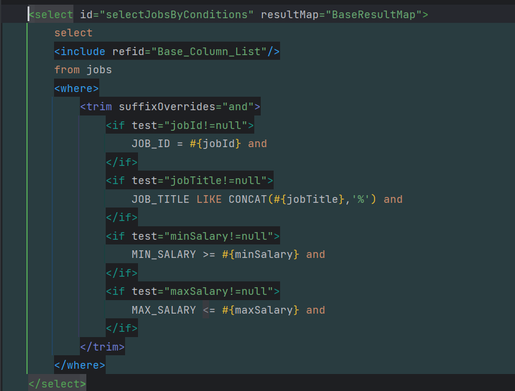 

#### 多表查询
##### 一对一
  * 查询老师对应的课程（一个课程一个老师）
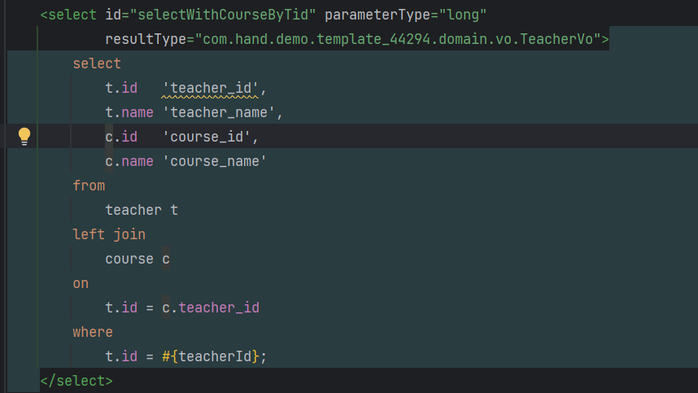
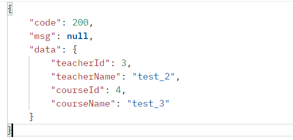
##### 一对多
  * 查询某个部门中的员工（一个部门多个员工）
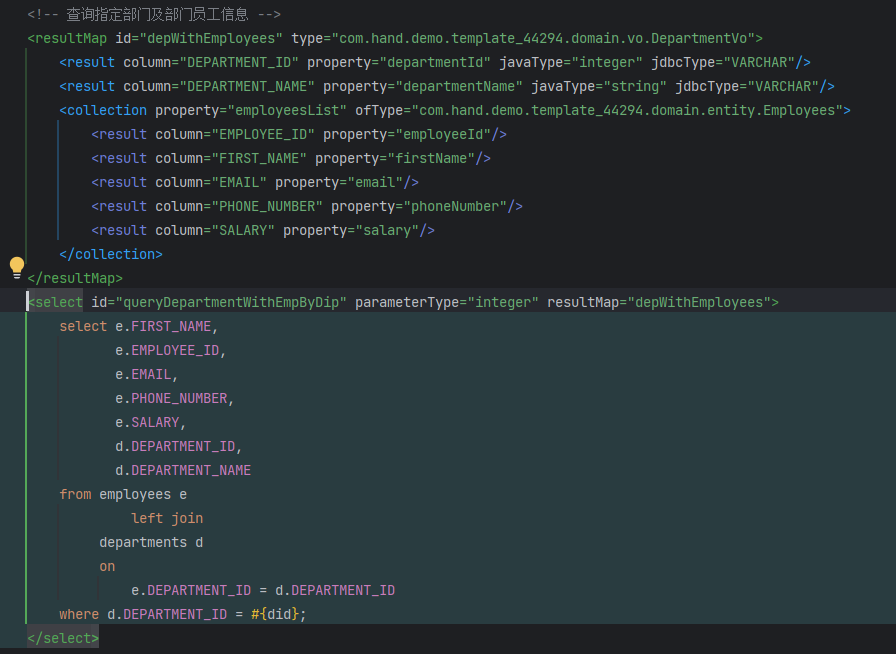
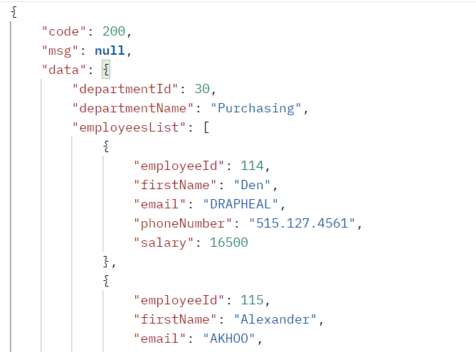
* 多对多
  * 查询各学生的成绩单信息（一个学生多门课程，一门课程多个学生）

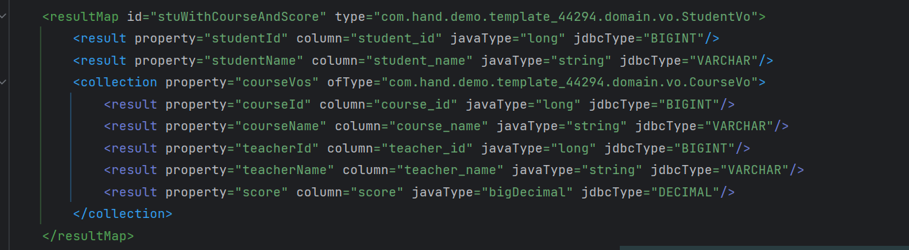

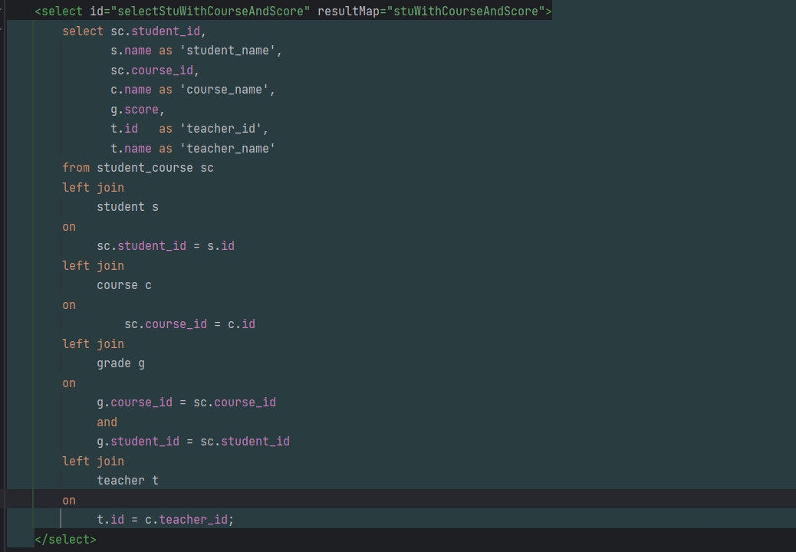

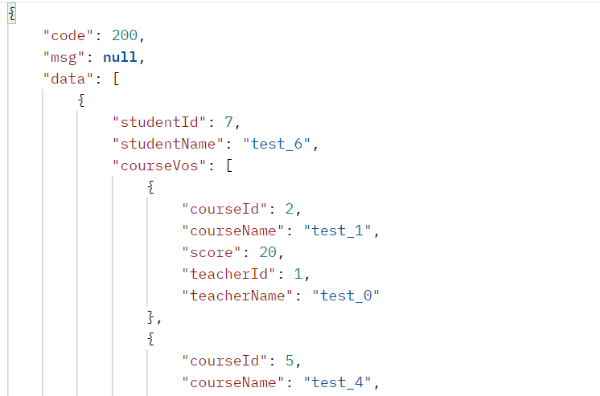
