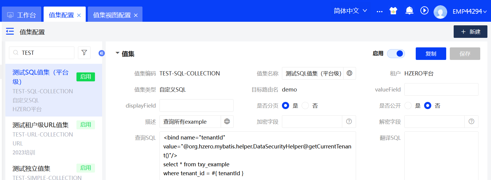
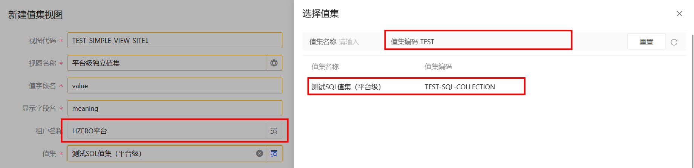
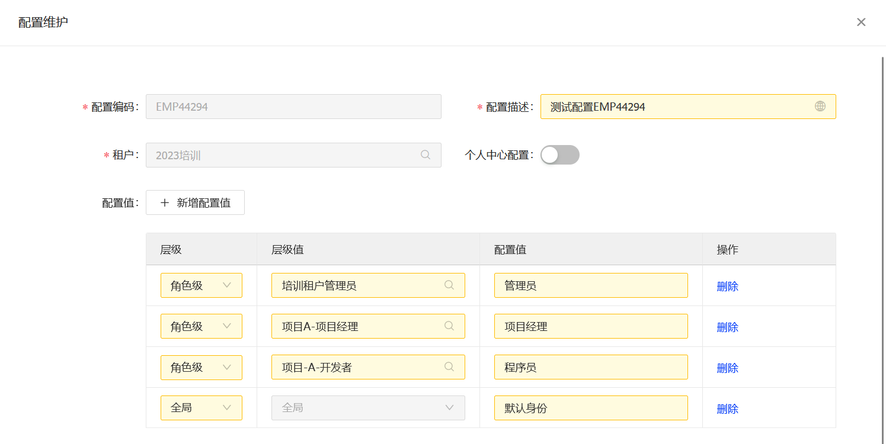
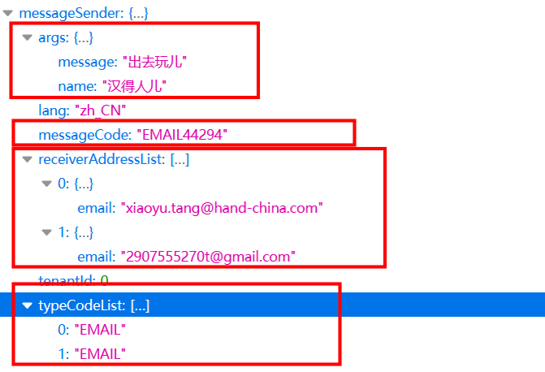

# 参考文档

* [如何通过图形界面操作平台？（服务端）](https://open.hand-china.com/document-center/doc/component/163/18316?doc_id=443481&doc_code=29036#%E6%96%B0%E5%BB%BA%E9%85%8D%E7%BD%AE%E7%BB%B4%E6%8A%A4)

* [如果通过代码操作平台？（客户端）](https://open.hand-china.com/document-center/doc/component/264/16721?doc_id=209938&doc_code=5411)

* [如何通过代码操作消息服务？（客户端）](https://open.hand-china.com/document-center/doc/component/170/30?doc_id=114&doc_code=114#%E6%B6%88%E6%81%AF%E6%9C%8D%E5%8A%A1%E5%AE%A2%E6%88%B7%E7%AB%AF)

* [如何管理文件服务（服务端）](https://open.hand-china.com/document-center/doc/component/168/12369?doc_id=132741&doc_code=8869)


# Hzero平台练习

### T1 服务运行

* 服务选配、启动成功、接口权限刷新、在swagger上测试成功


----


### T2 数据初始化

* 执行init-database脚本 


----


### T3 表设计和模板创建

* 猪齿鱼表设计


* 导出DDD脚本、DDL sql脚本（之前已经有DDD结构的内容了，这里将新文件复制过去）


* 在swagger上能注册并测试成功（已修改标签）


----


### T4.平台服务

* 租户、角色、菜单、子账户、API权限集

```
租户维护：新建新租户，限制用户数量，指定可使用的语言，设置是否对敏感数据加密存储
```


```
角色管理：新建角色，通过模板导入角色（批量的时候方便）--> 分配用户
```


```
菜单配置：创建菜单目录 --> 创建菜单
```


```
菜单权限分配：为角色分配菜单权限
```


```
创建子账户：选择租户 --> 设置密码 --> 为账号分配角色
```


```
查看菜单权限设置效果：
    1. 更换EMP44294的角色，查询已授权的菜单
    2. 更换test44294账号，查询已授权的菜单
```


```
API权限集：查看菜单权限集 --> 新建菜单权限集 --> 添加权限
```


* 值集配置、值集视图培训、可以预览LOV效果 

```
独立值集
1. 新建独立值集：并添加父级值集，添加并绑定值和父级值集值
2. 独立视图值集配置：设置租户（非指定租户账号无法访问该值集视图）
3. 视图预览，显示值集和父级值集对应的
```


```
SQL值集和值集视图
1. 新建SQL值集：编写查询SQL，绑定参数tenantId，查询指定租户的example数据
2. 配置SQL值集视图
3. 显示SQL值集预览效果
```




```
URL值集视图
1. 新建URL值集
2. 配置URL值集视图
3. 预览效果
```


```
练习小结：
    1. 租户可以访问平台级的值集，平台不能访问租户值集
    2. 只有对应租户的子账号才能正确访问值集视图
    3. 若平台级账号预览租户级值集视图 出错：未定义视图集
```




* 编码规则配置，通过代码可以生成编码规则值 

```
新增编码规则 规则层级 编码段
```


```
在客户端编写代码根据规则、编码段生成编码
```


```
1. 在swagger中进行测试
2. 建立URL值集，通过值集视图查看生成的编码
```


* 配置维护界面，通过代码可以获取配置维护的值 

```
1. 新增配置维护
2. 刷新配置维护
3. 编写获取配置维护的代码
```




```
WARNING: 配置提交后，会向Redis存入一个全局的配置值--> 默认身份
1. 当Redis中的profile丢失后，即使数据库中有profile数据，也会直接返回null
2. 此时直接获取配置会返回找不到profile name找不到，即使后端存在对用的profile name
3. 通过平台的刷新权限刷新 配置维护 --> 将默认的配置和<操作用户>匹配到的配置写入Redis
4. 传入参数分为tenantId\userId\roleId\profileName,如果缺失，会自动填充为平台默认值
```


* 客户端创建、通过postman测试使用客户端获取token，并调用API接口 

```
1. 创建客户端：返回项目经理角色的token
2. 获取用户Token
3. 从数据库查询roleId，根据tenantId和roleId匹配维护配置
```


* 数据权限规则、权限范围设置。调用API接口查看权限规则是否生效，可通过debug模式打印sql

```
创建数据权限规则： 
1. 指定租户范围 指定作用域表 指定拼接查询条件
配置数据权限范围：
1. 创建数据权限范围（指定哪个服务的哪个方法）
2. 添加权限规则（如何代理这个方法）
3. 将权限范围添加到权限规则中
```


----


### T5. 调度平台

* 熟悉执行器管理、调度任务配置

```
添加路由：自定义一个虚拟的服务，用于执行任务调度
```


```
添加执行器：指定调度任务所在的服务
```


```
添加调度任务：指定调度的任务执行器，执行策略，失败处理策略，阻塞策略以及执行周期
```


```
任务执行记录：每分钟的第5秒时执行
```


* 引入调度客户端，通过代码实现调度任务逻辑

```
1. 配置scheduler
2. 编写调度任务：@JobHandler标识调度任务，实现IJobHandler 
```


----

 

### T6. 通用导入

* 配置导入模板 

```
客户端模板
```


```
服务端模板
```


* 模板类型=客户端时，引入通用导入客户端，通过代码实现自定义校验、自定义导入逻辑

```
客户端配置：
    1. 引入依赖
    2. 创建数据库表存储临时数据：himp_data\himp_import\himp_local_template
    3. 配置参数
```


```
客户端代码编写：
    1. 自定义校验逻辑
    2. 实现数据导入接口
```


* 模板类型=服务端时，直接导入数据到表里。---- 可导入国家、币种等信息


----


### T7. 消息管理

* 配置邮箱账户、消息模板、消息发送配置；测试发送消息给自己的邮箱

```
配置邮箱账户：提前拿到SMTP授权码
```


```
配置消息模板
```


```
消息配置
```


```
发送邮箱，在消息监控中查看消息发送记录，查看接收者的邮件
```


* 引入消息服务客户端，通过代码调用消息服务客户端，根据消息代码发送；根据消息类型+账号发送消息

```
1. 导入依赖
2. 编写邮件和站内消息发送的服务层逻辑
3. 根据请求参数编写Api接口
```





----


### T8. 文件服务：

* 理解UUID和file的关系

```
1. 文件存储配置中的UUID设置是为了避免同名文件被覆盖所设置
2. 借助UUID的唯一性，保证文件名的唯一性
3. 文件名前缀策略：
    a. UUID: 在文件名前添加UUID前缀: ${UUID}@{fileName}
    b. 目录: 以UUID为名创建目录，将文件保存在该唯一的目录中
```

* 通过postman调用文件服务接口上传图片、PDF等；然后通过文件汇总查询信息

```
通过平台服务端上传
```


```
控制台获取接口
```


* 引入文件服务客户端，通过代码上传附件到文件服务中

```
1. 引入依赖
2. 修改配置
3. 注入FileClient，编写接口
```


----


### T9. 报表平台：

* 配置数据集、报表模板管理、报表定义

```
配置数据集：配置数据源，并测试连接成功
```


```
新建数据集：绑定数据源，编写SQL查询语句，校验SQL语句，初始化元数据
```


```
报表定义：
    1. 新建报表定义：简单表格、复杂表格（分类）、图形报表
    2. 报表查询：查看报表的显示效果
```


```
报表导出
```


```
报表模板管理
```


* 配置仪表板（简单表格、饼状图），发布成路由

```
1. 新建、设计仪表盘
2. 上线仪表盘，生成路由信息
3. 查询仪表盘
```


* 到培训租户下，以“工号-姓名”创建一级目录，将页面表格、图形报表、仪表板路由挂到菜单上


