## 2023-9-8 更新
### 更新的目录结构
* Controller (由后端解析视图并返回)
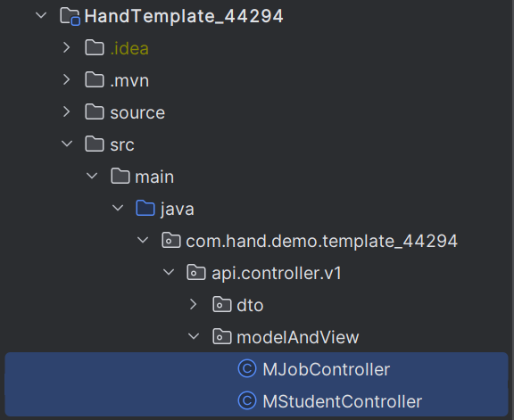

* html文件
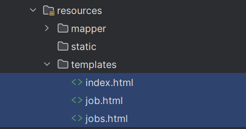

* 微服务模块
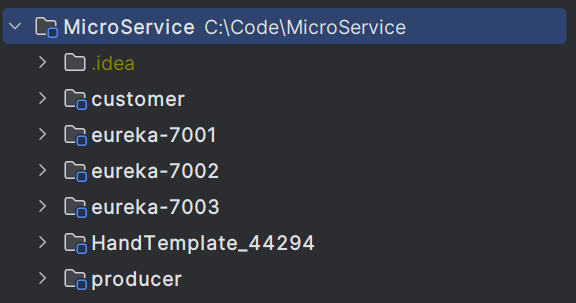

#### Maven管理微服务模块
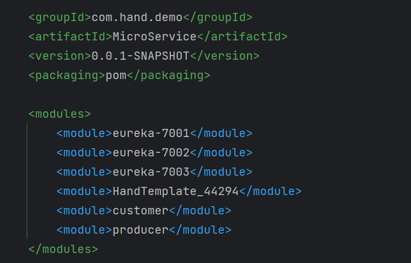
#### 搭建Eureka集群，并完成服务注册
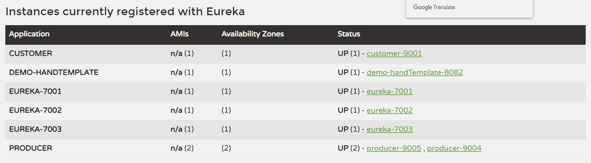

#### 完成WebPage编写
<code>多条件查询和分数录入参数传递类似，这里采用了查询，就没有做录入分数了</code>
* 首页

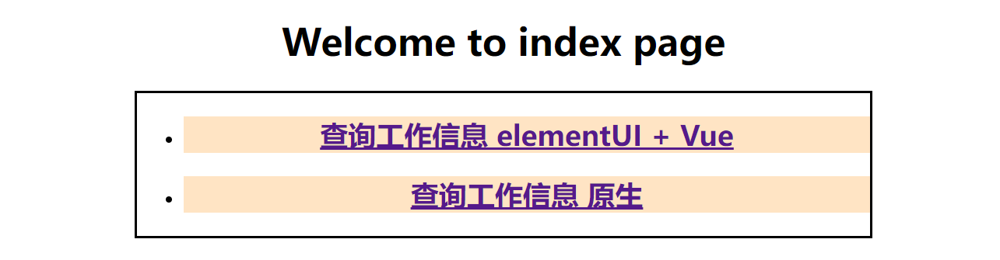
* ElementUI + Vue + Axios异步获取数据

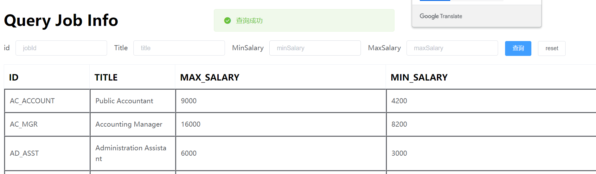
* 多条件查询

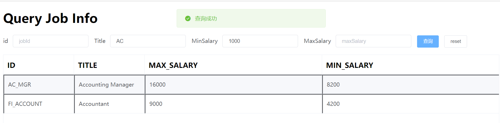
* 原生HTML + Form + ModelAndView刷新页面获取数据
    * ModelAndView方式中采用Thymeleaf传递参数

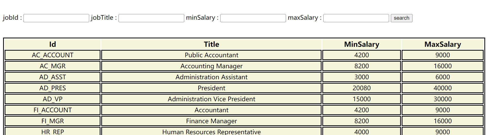
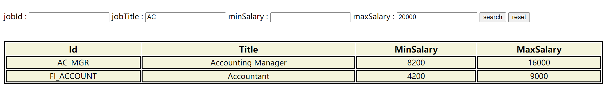
#### Ribbon负载均衡
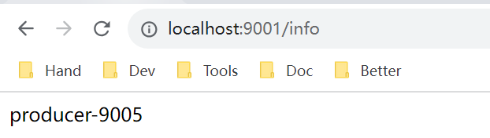
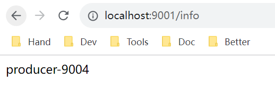
