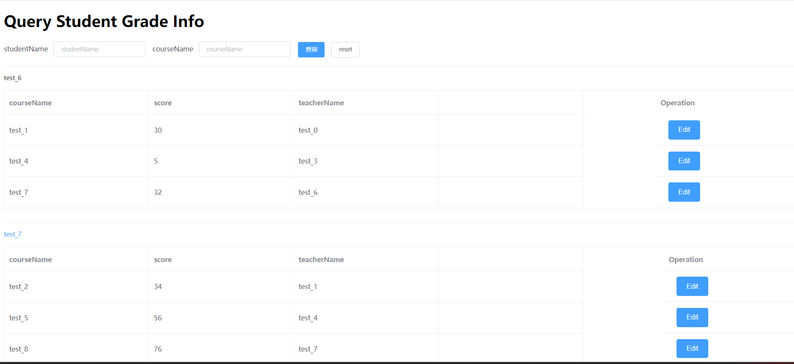
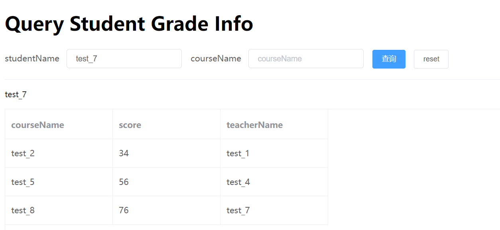
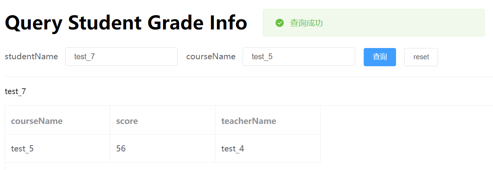
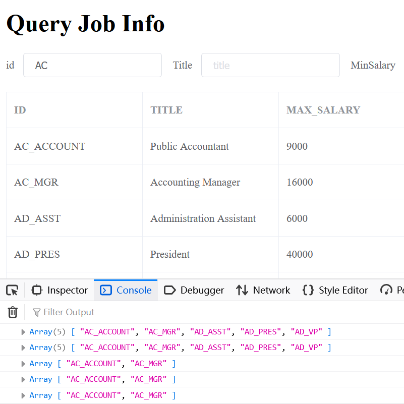
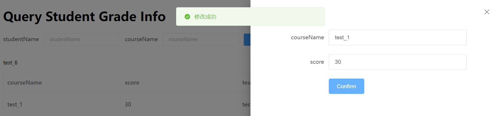

### 仓库更改
之前的单体Web应用目录不方便整合微服务
为了更好地记录后续微服务的学习和练习，用新仓库记录

原项目仓库：[HandTemplate仓库地址](https://github.com/2907555270/HandTemplate_44294)

## 2023-9-9 学习
### 负载均衡
#### 策略
* 轮询
* 随机
* 重试:失败后，短暂故障时
* 权重：根据响应时间设置权重
* 最佳策略：
  * 遍历所有服务实例，过滤故障的，找到请求数最小的实例
* 可用过滤策略：
  * 可用的实例：不故障且请求数未超过阈值
  * 轮询访问可用的实例
#### 如何修改
* 配置文件中
```yml
[service_name]:
  ribbon:
    NFLoadBalancerRuleClassName: [class]
```
#### 如何选择
* 如果配置一样：默认轮询
* 配置不一致：性能强的权重高

### Ribbon和Feign
#### Ribbon
* 客户端
* 底层采用RestTemplate
##


## 2023-9-8 作业
### 更新目录结构
* Controller (由后端解析视图并返回)


* html文件


* 微服务模块


### 规范化代码和SQL
* 取消使用Lombok
* 修改SQL语句
* 重命名类（单数）

### Maven管理微服务模块


### 搭建Eureka集群，并完成服务注册


### 完成WebPage编写
* 首页


* ElementUI + Vue + Axios异步获取数据



* 多条件查询




* 搜索提示（前端提示框显示不出来）


* 成绩修改



* 原生HTML + Form + ModelAndView刷新页面获取数据
    * ModelAndView方式中采用Thymeleaf传递参数


### Ribbon负载均衡


