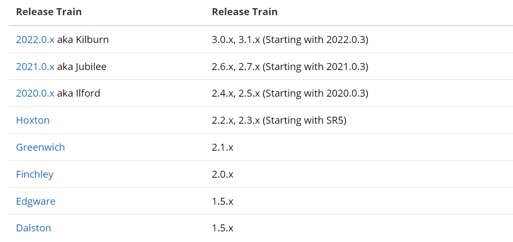
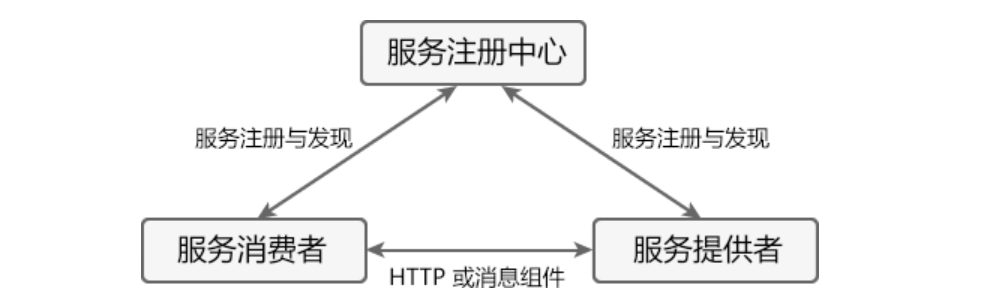
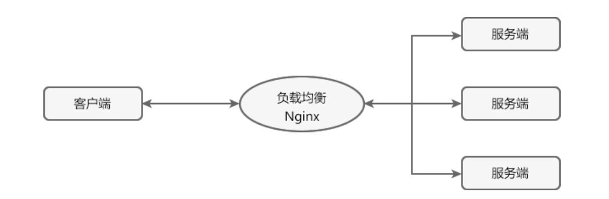
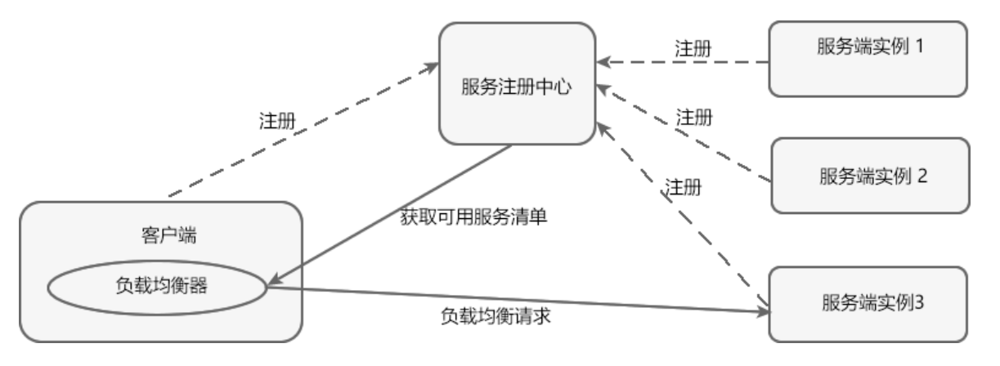
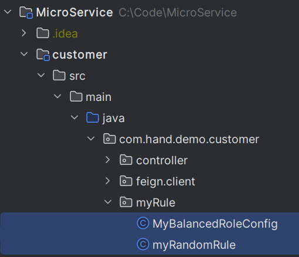

# 微服务
## 概述
* 体积小，专注于一件事
* 可独立部署
* 独立启动和销毁，不影响其他服务
* 标准的通讯协议完成交互：HTTP RESTFUL API
### 特点
* 可采用不同的技术方案：编程语言、持久层组件....
* 可单独修改或扩展某个服务
* 配合Docker实现快速迭代、构建、部署
* 服务具备良好的故障隔离能力
* 具备链路追踪能力
### 组件介绍
| 组件                           | 描述                                                         |
|------------------------------| ------------------------------------------------------------ |
| Spring Cloud Netflix Eureka  | Spring Cloud Netflix 中的**服务治理**组件，包含服务注册中心、服务注册与发现机制的实现。 |
| Spring Cloud Netflix Ribbon  | Spring Cloud Netflix 中的**服务调用**和**客户端负载均衡**组件。      |
| Spring Cloud Netflix Hystrix | 人称“豪猪哥”，Spring Cloud Netflix 的**容错管理组件**，为服务中出现的延迟和故障提供**强大的容错能力**。 |
| Spring Cloud Netflix Feign   | **基于 Ribbon 和 Hystrix 的声明式服务调用组件**。                |
| Spring Cloud Netflix Zuul    | Spring Cloud Netflix 中的**网关组件**，提供了**智能路由、访问过滤**等功能。 |
| Spring Cloud Gateway         | 一个基于 Spring 5.0，Spring Boot 2.0 和 Project Reactor 等技术开发的网关框架，它使用 Filter 链的方式提供了网关的基本功能，例如安全、监控/指标和限流等。 |
| Spring Cloud Config          | Spring Cloud 的**配置管理工具**，支持使用 Git 存储配置内容，实现应用**配置的外部化存储**，并支持在客户端对配置进行**刷新、加密、解密**等操作。 |
| Spring Cloud Bus             | Spring Cloud 的**事件和消息总线**，主要用于在集群中传播事件或状态变化，以触发后续的处理，例如动态刷新配置。 |
| Spring Cloud Stream          | Spring Cloud 的**消息中间件组件**，它集成了 Apache Kafka 和 RabbitMQ 等消息中间件，并通过定义绑定器作为中间层，完美地实现了**应用程序与消息中间件之间的隔离**。通过向应用程序暴露统一的 Channel 通道，使得应用程序不需要再考虑各种不同的消息中间件实现，就能轻松地发送和接收消息。 |
| Spring Cloud Sleuth          | Spring Cloud **分布式链路跟踪组件**，能够完美的整合 Twitter 的 Zipkin。 |
### SpringBoot和SpringCloud
* Boot快速构建一个单独的服务,Cloud管理很多单独的服务
* Cloud基于Boot开发
* 版本关系


## 微服务组件
### 服务注册与发现(Eureka)
#### 组成
* Server(Eureka)
  * 服务注册
  * 维护了一个可用服务列表
  * 移除不可用的服务(90s)
* Client(其他微服务)
  * 和 Eureka Server 进行交互
  * 向 Eureka Server 发送心跳(30s)
#### 原理

* 注册中心
  * 提供注册和发现功能
* 提供者
  * 将自己的服务注册到注册中心，让消费者可以发现
* 消费者
  * 从注册中心获取提供者的服务列表
* 自我保护
  * 好死不如赖活着
  * 死得多可能是假死
  * 注册中心死了，在客户端心里还没死（缓存）
#### 流程
* Eureka Server服务中心
* 服务提供者 Client 将自己按照Application.name注册到服务中心
* 服务消费者 Client 将自己注册
* 服务消费者要一份可访问的服务列表，且缓存在本地
* 服务消费者根据列表直接访问服务提供者
#### 使用
* @EnableEurekaServer
* @EnableEurekaClient
* 集群搭建

### 负载均衡(Ribbon)
#### 概述
* 高并发、缓解网络压力和服务端扩容
* 将用户的请求平摊分配到多个服务器上运行
* Ribbon
  * 工具型框架，不需要独立部署
  * 负责微服务之间的调用，API网关的请求
#### 方式
* 服务端负载均衡
  * 在客户端和服务端之间建立一个独立的负载均衡服务器
  * 先发送请求，再进行负载均衡
  * 客户端不知道哪个服务端提供服务
  * 可用服务端清单存储在负载均衡服务器上
  * Nginx

* 客户端负载均衡
  * 负载均衡器位于客户端,不需要单独搭建一个负载均衡服务器
  * 从注册中心获取一份可用服务清单到客户端本地
  * 需要心跳机制去维护服务端清单的有效性
  * 先负载均衡，再发送请求
  * 客户端清楚地知道是哪个服务端提供的服务

#### 策略
| 实现类                       | 负载均衡策略                                                                                                                                                                                            |
|---------------------------|---------------------------------------------------------------------------------------------------------------------------------------------------------------------------------------------------|
| RoundRobinRule            | 按照**线性轮询**策略，即按照一定的顺序依次选取服务实例                                                                                                                                                                     |
| RandomRule                | **随机选取**一个服务实例                                                                                                                                                                                    |
| RetryRule                 | 按照 RoundRobinRule（轮询）的策略来获取服务，如果**获取的服务实例为 null 或已经失效**，则在**指定的时间之内不断地进行重试**（重试时获取服务的策略还是 RoundRobinRule 中定义的策略），如果**超过指定时间依然没获取到服务实例则返回 null** 。                                                 |
| WeightedResponseTimeRule  | WeightedResponseTimeRule 是 RoundRobinRule 的一个子类，它对 RoundRobinRule 的功能进行了扩展。  **根据平均响应时间，来计算所有服务实例的权重，响应时间越短的服务实例权重越高**，被选中的概率越大。**刚启动时，如果统计信息不足，则使用线性轮询策略**，等信息足够时，再切换到 WeightedResponseTimeRule。 |
| BestAvailableRule         | 继承自 ClientConfigEnabledRoundRobinRule。**先过滤点故障或失效**的服务实例，然后再**选择并发量最小**的服务实例。                                                                                                                     |
| AvailabilityFilteringRule | 先**过滤掉故障或失效的服务实例**，然后**再轮询选择可用**（并发量较小的）的服务实例。                                                                                                                                                    |
| **ZoneAvoidanceRule**（）   | 默认的负载均衡策略，综合判断服务所在区域（zone）的性能和服务（server）的可用性，来选择服务实例。在没有区域的环境下，该策略与轮询（RandomRule）策略类似。                                                                                                            |
#### 使用
* @LoadBalanced
* 切换策略
  * 导入Ribbon依赖
  * 注入IRule类型的Bean
``` Java
@Bean
public IRule myRule() {
    // RandomRule 为随机策略
    return  new RandomRule();
}
```
* 定制负载均衡策略
  * 继承AbstractLoadBalancerRule
  * 重写choose方法:每个服务访问三次，然后轮询切换到其他服务
  * 定制负载均衡配置类，将自定义负载均衡策略注入IOC容器
  * 启动类@RibbonClient(name={application.name},configuration=MyRibbon.class)

### 声明式服务调用(Feign-->OpenFeign->支持Spring MVC注解)
#### Feign Vs OpenFeign
* 相同
  * SpringCloud下的远程调用和负载均衡组件
  * 对Ribbon进行集成，利用Ribbon维护可用服务列表，利用Ribbon实现**客户端**的负载均衡
* 区别
  * 依赖项
  * 注解
#### 使用
* 添加依赖
```pom
    <dependency>
        <groupId>org.springframework.cloud</groupId>
        <artifactId>spring-cloud-starter-openfeign</artifactId>
    </dependency>
    <dependency>
        <groupId>org.springframework.cloud</groupId>
        <artifactId>spring-cloud-starter-netflix-ribbon</artifactId>
    </dependency>
```
* 创建FeignClient接口 + 定义远程调用的url和参数(和Controller相反)
  * @FeignClients value属性为远程服务的spring.application.name
  * 启用FeignClient之后，之前的RestTemplate似乎失效了：UnknownHostException
#### 配置
* Feign默认1s超时报错
  * 修改配置
``` yml
ribbon:
        ReadTimeout: 6000 #建立连接所用的时间，适用于网络状况正常的情况下，两端两端连接所用的时间
        ConnectionTimeout: 6000 #建立连接后，服务器读取到可用资源的时间
```
* Feign日志配置

### Hystrix
