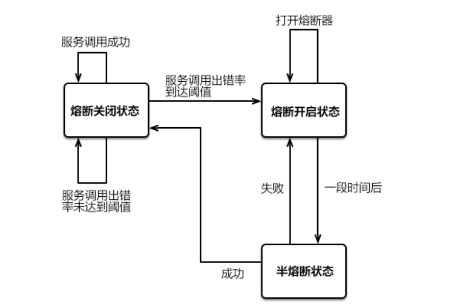

### 参考文档
### <code>[SpringCloud教程](http://c.biancheng.net/springcloud/what-is-alibaba.html)</code>

# 微服务
## 概述
* 体积小，专注于一件事
* 可独立部署
* 独立启动和销毁，不影响其他服务
* 标准的通讯协议完成交互：HTTP RESTFUL API
### 特点
* 可采用不同的技术方案：编程语言、持久层组件....
* 可单独修改或扩展某个服务
* 配合Docker实现快速迭代、构建、部署
* 服务具备良好的故障隔离能力
* 具备链路追踪能力
### 组件介绍
| 组件                           | 描述                                                         |
|------------------------------| ------------------------------------------------------------ |
| Spring Cloud Netflix Eureka  | Spring Cloud Netflix 中的**服务治理**组件，包含服务注册中心、服务注册与发现机制的实现。 |
| Spring Cloud Netflix Ribbon  | Spring Cloud Netflix 中的**服务调用**和**客户端负载均衡**组件。      |
| Spring Cloud Netflix Hystrix | 人称“豪猪哥”，Spring Cloud Netflix 的**容错管理组件**，为服务中出现的延迟和故障提供**强大的容错能力**。 |
| Spring Cloud Netflix Feign   | **基于 Ribbon 和 Hystrix 的声明式服务调用组件**。                |
| Spring Cloud Netflix Zuul    | Spring Cloud Netflix 中的**网关组件**，提供了**智能路由、访问过滤**等功能。 |
| Spring Cloud Gateway         | 一个基于 Spring 5.0，Spring Boot 2.0 和 Project Reactor 等技术开发的网关框架，它使用 Filter 链的方式提供了网关的基本功能，例如安全、监控/指标和限流等。 |
| Spring Cloud Config          | Spring Cloud 的**配置管理工具**，支持使用 Git 存储配置内容，实现应用**配置的外部化存储**，并支持在客户端对配置进行**刷新、加密、解密**等操作。 |
| Spring Cloud Bus             | Spring Cloud 的**事件和消息总线**，主要用于在集群中传播事件或状态变化，以触发后续的处理，例如动态刷新配置。 |
| Spring Cloud Stream          | Spring Cloud 的**消息中间件组件**，它集成了 Apache Kafka 和 RabbitMQ 等消息中间件，并通过定义绑定器作为中间层，完美地实现了**应用程序与消息中间件之间的隔离**。通过向应用程序暴露统一的 Channel 通道，使得应用程序不需要再考虑各种不同的消息中间件实现，就能轻松地发送和接收消息。 |
| Spring Cloud Sleuth          | Spring Cloud **分布式链路跟踪组件**，能够完美的整合 Twitter 的 Zipkin。 |
### SpringBoot和SpringCloud
* Boot快速构建一个单独的服务,Cloud管理很多单独的服务
* Cloud基于Boot开发
* 版本关系


## 微服务组件
### 服务注册与发现(Eureka)
#### 组成
* Server(Eureka)
  * 服务注册
  * 维护了一个可用服务列表
  * 移除不可用的服务(90s)
* Client(其他微服务)
  * 和 Eureka Server 进行交互
  * 向 Eureka Server 发送心跳(30s)
#### 原理

* 注册中心
  * 提供注册和发现功能
* 提供者
  * 将自己的服务注册到注册中心，让消费者可以发现
* 消费者
  * 从注册中心获取提供者的服务列表
* 自我保护
  * 好死不如赖活着
  * 死得多可能是假死
  * 注册中心死了，在客户端心里还没死（缓存）
#### 流程
* Eureka Server服务中心
* 服务提供者 Client 将自己按照Application.name注册到服务中心
* 服务消费者 Client 将自己注册
* 服务消费者要一份可访问的服务列表，且缓存在本地
* 服务消费者根据列表直接访问服务提供者
#### 使用
* @EnableEurekaServer
* @EnableEurekaClient
* 集群搭建

### 负载均衡(Ribbon)
#### 概述
* 高并发、缓解网络压力和服务端扩容
* 将用户的请求平摊分配到多个服务器上运行
* Ribbon
  * 工具型框架，不需要独立部署
  * 负责微服务之间的调用，API网关的请求
#### 方式
* 服务端负载均衡
  * 在客户端和服务端之间建立一个独立的负载均衡服务器
  * 先发送请求，再进行负载均衡
  * 客户端不知道哪个服务端提供服务
  * 可用服务端清单存储在负载均衡服务器上
  * Nginx

* 客户端负载均衡
  * 负载均衡器位于客户端,不需要单独搭建一个负载均衡服务器
  * 从注册中心获取一份可用服务清单到客户端本地
  * 需要心跳机制去维护服务端清单的有效性
  * 先负载均衡，再发送请求
  * 客户端清楚地知道是哪个服务端提供的服务

#### 策略
| 实现类                       | 负载均衡策略                                                                                                                                                                                            |
|---------------------------|---------------------------------------------------------------------------------------------------------------------------------------------------------------------------------------------------|
| RoundRobinRule            | 按照**线性轮询**策略，即按照一定的顺序依次选取服务实例                                                                                                                                                                     |
| RandomRule                | **随机选取**一个服务实例                                                                                                                                                                                    |
| RetryRule                 | 按照 RoundRobinRule（轮询）的策略来获取服务，如果**获取的服务实例为 null 或已经失效**，则在**指定的时间之内不断地进行重试**（重试时获取服务的策略还是 RoundRobinRule 中定义的策略），如果**超过指定时间依然没获取到服务实例则返回 null** 。                                                 |
| WeightedResponseTimeRule  | WeightedResponseTimeRule 是 RoundRobinRule 的一个子类，它对 RoundRobinRule 的功能进行了扩展。  **根据平均响应时间，来计算所有服务实例的权重，响应时间越短的服务实例权重越高**，被选中的概率越大。**刚启动时，如果统计信息不足，则使用线性轮询策略**，等信息足够时，再切换到 WeightedResponseTimeRule。 |
| BestAvailableRule         | 继承自 ClientConfigEnabledRoundRobinRule。**先过滤点故障或失效**的服务实例，然后再**选择并发量最小**的服务实例。                                                                                                                     |
| AvailabilityFilteringRule | 先**过滤掉故障或失效的服务实例**，然后**再轮询选择可用**（并发量较小的）的服务实例。                                                                                                                                                    |
| **ZoneAvoidanceRule**（）   | 默认的负载均衡策略，综合判断服务所在区域（zone）的性能和服务（server）的可用性，来选择服务实例。在没有区域的环境下，该策略与轮询（RandomRule）策略类似。                                                                                                            |
#### 使用
* @LoadBalanced
* 切换策略
  * 导入Ribbon依赖
  * 注入IRule类型的Bean
``` Java
@Bean
public IRule myRule() {
    // RandomRule 为随机策略
    return  new RandomRule();
}
```
* 定制负载均衡策略
  * 继承AbstractLoadBalancerRule
  * 重写choose方法:每个服务访问三次，然后轮询切换到其他服务
  * 定制负载均衡配置类，将自定义负载均衡策略注入IOC容器
  * 启动类@RibbonClient(name={application.name},configuration=MyRibbon.class)

### 声明式服务调用(Feign-->OpenFeign->支持Spring MVC注解)
#### Feign Vs OpenFeign
* 相同
  * SpringCloud下的远程调用和负载均衡组件
  * 对Ribbon进行集成，利用Ribbon维护可用服务列表，利用Ribbon实现**客户端**的负载均衡
* 区别
  * 依赖项
  * 注解
#### 使用
* 添加依赖
```pom
    <dependency>
        <groupId>org.springframework.cloud</groupId>
        <artifactId>spring-cloud-starter-openfeign</artifactId>
    </dependency>
    <dependency>
        <groupId>org.springframework.cloud</groupId>
        <artifactId>spring-cloud-starter-netflix-ribbon</artifactId>
    </dependency>
```
* 创建FeignClient接口 + 定义远程调用的url和参数(和Controller相反)
  * @FeignClients value属性为远程服务的spring.application.name
  * 启用FeignClient之后，之前的RestTemplate似乎失效了：UnknownHostException
#### 配置
* Feign默认1s超时报错
  * 修改配置
``` yml
ribbon:
        ReadTimeout: 6000 #建立连接所用的时间，适用于网络状况正常的情况下，两端两端连接所用的时间
        ConnectionTimeout: 6000 #建立连接后，服务器读取到可用资源的时间
```
* Feign日志配置

### Hystrix
#### 概念
* 雪崩效应
  * A->B->C 
* 熔断器
  * if A->B(X) then B(fallBack)->A
#### 目标：不给别人惹麻烦
* 保护线程资源：防止单个服务的故障耗尽系统中的所有线程资源
* **快速失败**机制：当某个服务发生了故障，不让服务调用方一直等待，而是**直接返回请求失败**
* 提供**降级（FallBack）方案**：在请求失败后，提供一个设计好的降级方案，通常是一个兜底方法，当请求失败后即调用该方法 
* 防止故障扩散：使用熔断机制，**防止故障扩散**到其他服务 
* 监控功能：提供熔断器故障监控组件 Hystrix Dashboard，随时**监控熔断器的状态**
#### 服务降级(Fallback)
* **使用场景**
  * 服务器压力剧增：不处理或简单处理不重要不紧急的请求
    * 线程池资源耗尽
  * 服务不可用时：主动降级提供一个友好的提示
    * 程序运行异常
    * 服务超时
  * **熔断器**处于打开状态 
* 服务端做降级
  * 为对应的方法使用@HystrixCommand + @HystrixProperties实现
* 客户端做降级(常用)
  * 节省服务器资源
  * 配置客户端超时时间(建立连接 + 读取到资源)
  * 配置请求超时时间
  * 全局降级方法的优先级较低，只有业务方法没有指定其降级方法时，服务降级时才会触发全局回退方法
* 注意
  * 所有的配置，一定要开启Feign.hystrix.enabled=true
  ```yml
  feign:
    hystrix:
      enabled: true
  ```
  * 降级（FallBack）方法必须与其对应的业务方法在同一个类中，否则无法生效
* **解耦降级**
  * FeignClient接口事先类必须以组件的形式添加 Spring 容器中才能生效
#### 服务熔断
* 目的
  * 应对雪崩效应
  * 微服务链路保护机制
  * 错多了，就不再请求调用了
* 熔断状态
  * 关闭：服务可以正常访问
  * 打开：出错达到一定的比例(20次出错50%以上)-->服务不能正常访问，启动本地降级方法
  * 半熔断
    * 尝试恢复对服务的调用，允许部分请求调用该服务
    * 当成功率达到预期后，说明服务已恢复正常--->熔断器关闭
    * 成功率达不到预期，说明服务还有问题--->熔断器重新开启

* 实现
  * @HystrixCommand：可用于任何方法
#### 故障监控
* 导入dashboard依赖
* 配置dashboard允许访问的ip
* 配置dashboard流访问路径
* @EnableHystrixDashboard


----
### 网关(Gateway)
* 背景
  * 微服务大量应用--->不同地区、机房、ip
  * 跨域请求问题
  * 身份认证问题
* 目的
  * 统一处理服务地址：知道 网关地址 -> 服务地址
  * 客户端 少和 各个服务交互
  * 客户端和后端的服务耦合度降低
  * 安全、流控、过滤、缓存、计费以及监控....
* 小知识
  * SpringCloudGateWay <-- WebFlux <-- Netty(Reactor模式通信：高性能)
* 核心：路由转发
  * 路由：id + 目标URI + 断言 + 过滤器
  * 断言(匹配)
  * 过滤：拦截和修改
* 功能
  * 在任意请求属性上匹配路由
  * 集成了Hystrix
  * 集成了服务发现Client
  * 易于编写断言和过滤器
  * 限制请求路劲和请求频率

* 流程
  * 请求 --> handler Mapping --> handler Adapter
  * handler Adapter转发请求和响应结果
  * 请求 --> 过滤器链 
  * 请求和响应 可以在 过滤器链之间 可以 执行其他的业务逻辑
  * handler Adapter --> 响应


#### 断言
* Predictable(将路由和断言看作整体)
  * 一个路由Route可以包含多个不同的断言Predictable
  * 一个请求想要转发到指定的路由上，就必须**同时匹配路由上的所有断言**
  * 当一个请求同时满足多个路由的断言条件时，请求只会被**首个成功匹配的路由转发**
* 常用断言
  * 路径
  * 时间
  * 数据
    * Cookie
    * Header
  * 方法
    * Method
* 配置
``` yml
spring:
  application:
    name: gateway-server
  cloud:
    gateway:
      routes:
        # 隐藏网关的ip,只暴露API
        - id: customer_routh # 路由id，没有规则，但唯一
          uri: lb://customer
          predicates:
            - Path=/customer/**
            - Method=GET # 只能Get请求才能访问
```

#### 过滤器
* 分类
  * Pre(请求)
    * **参数校验**
    * **权限验证**
    * 流量监控
    * 日志输出
    * 协议转换
  * Post(响应)
    * 修改响应内容、响应头
    * 日志输出
    * 流量监控
* GatewayFilter(单个|单组路由)
  * AddRequestHeader
  * AddRequestParameter
  * RemoveRequestParameter
  * AddResponseHeader
  * RemoveResponseHeader
  * PrefixPath
  * PreserveHostHeader:保持客户端的HOST不变，转发给其他服务
  * RequestSize
``` yml
  cloud:
    gateway:
      routes:
        # 隐藏网关的ip,只暴露API
        - id: customer_routh # 路由id，没有规则，但唯一
          uri: lb://customer
          predicates:
            - Path=/**
            - Method=GET # 只能Get请求才能访问
          filters:
            - PrefixPath=/customer
```
* GlobalFilter(全局)
  * 自定义
    * 实现GlobalFilter,Ordered接口
    * 重写filter方法
      * exchange中获取请求和响应
    ``` java
        String entrance = exchange.getRequest().getQueryParams().getFirst("entrance");
        if(entrance==null){
            System.err.println("参数不能为空");
            exchange.getResponse().setStatusCode(HttpStatus.NOT_ACCEPTABLE);
            return exchange.getResponse().setComplete();
        }
        return chain.filter(exchange);
    ```
    * getOrder方法中设置过滤器的优先级
    * 交给Spring容器管理

### 配置中心(Spring Cloud Config)
#### 背景
  * 服务多，配置多，管理难度大
  * 配置跟随源码，容易泄露
  * 修改配置麻烦，需要重启
  * 无法支持动态调整
#### 组成
* Config Server
  * 独立运行的微服务应用
  * 连接配置仓库
  * 为客户端提供获取信息的接口
* Config Client
  * 各个微服务应用
  * 从Config Server获取配置信息
#### 配置存储方式
* Git
* SVN
* 本地文件系统
#### 工作原理

#### 工作流程
* Push config file --> Git
* Config Server Get file --> Git
* Service Get file --> Config Server URL
#### 特点
* 配置文件集中外部存储、统一管理
* 将配置以REST API形式暴露
* 可以察觉到配置更改，自动获取并应用
* 适合多环境开发、部署、切换
#### 实现
* 服务端
  * 配置git仓库和分支
  * @EnableConfigServer
  * 上传配置文件到git仓库
  * REST API访问获取配置(配置中设置https代理)
  * 配置更新后可以获取到仓库中的新配置


* 客户端
  * 配置git 文件名\profile\label
  * 配置本地的config center uri(ip地址+端口)
  * bootstrap.yml:系统级别,加载优先级高,用于获取外部配置
  * 配置更新后,依旧使用原配置

#### 解决手动刷新的问题
* 手动重启 --> 手动发送post请求刷新配置文件

#### Config + Bus ---> 动态刷新
* 手动发送post请求 --> 消息队列的TOPIC中
* 订阅该TOPIC的客户端 都 能收到该消息 --> 客户端 向 服务 拉取 最新配置信息
* 实现一次Post请求 --> 刷新所有配置文件

